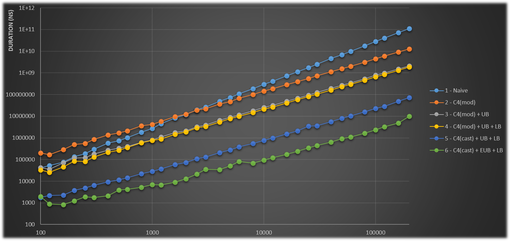

# FourSquares

**Algorithmic testbed for the Lagrange four-squares problem**

------

The above code proposes different algorithms to find all solutions to the Lagrange's four-squares problem:

&nbsp; &nbsp; &nbsp; &nbsp; **∀ n ∈ ℕ, ∃ (a, b, c, d) ∈ ℕ | a²+b²+c²+d² = n**

The following algorithms have been implemented in Java:

1) **Naive algorithm** → we swipe `a`, `b`, `c` and `d` to find all solutions. The majorant is deducted from the fact that **`X ≤ sqrt(n/4)`, where `X = a, b, c, d`**.

2) **Degree-4 checking (modulo)**: checking parameter `d` using the modulo → we only swipe over `a`, `b` and `c` and check that **`d` ∈ ℕ** using the instruction: `d % 1 == 0`.

3) **Simple upper-bounding**: setting an upper-bound to `a`, `b` and `c` → the folloowing constraint has been given to avoid redundant solutions: `a > b > c > d` (e.g. `[2,2,0,0]` and `[0,2,0,2]` are solutions for `n=32`).

4) **Lower-bounding**: setting a lower bound to `a`, `b` and `c` → those bounds are easily deducted from the problem formula: `a²+b²+c²+d² = n` and the below optimization. It implies that `4a² > n`, `3b² > n-a²` and `2c² > n-a²-b²`.

5) **Degree-4 checking (cast)**: checking parameter `d` using Java type casting → we check that **`d` ∈ ℕ** using the instruction: `d == (int) d`.

6) **Enhanced upper-bounding**: combining the optimization 3 with another upper-bound → those bounds can be easily deduced from the problem formula; `a² ≤ n`, `b² ≤ n-a²` and `c² ≤ n-a²-b²`.

A simple table sums up some important features for those algorithms:
| Algorithm | Time complexity | Memory complexity | Redundant solutions | Aim decrease coefficient |
|:---|:---:|:---:|:---:|:---:|
| 1 - naive | O(n⁴) | O(1) | YES | 1.009 |
| 2 - C4(mod) | O(n³) | O(1) | YES | 0.563 |
| 3 - C4(mod) + UB | O(n³) | O(1) | `NO` | 0.563 |
| 4 - C4(mod) + UB + LB | O(n³) | O(1) | `NO` | 0.511 |
| 5 - C4(cast) + UB + LB | O(n³) | O(1) | `NO` | 0.518 |
| 6 - C4(cast) + EUB + LB | O(n³) | O(1) | `NO` | 0.517 |

---

Here is a benchmark I made in my laptop. For each algorithm and each input value, 5 iterations have been done and the mean value is displayed in the graph:

    PC  - ASUS R510C
    CPU - Intel Core i5-3337U (x64)
    OS - Windows 10 v.21H1 build 19043.1586
    2 physical cores
    

